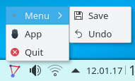

# JAppIndicator
A Systray Icon for java, using the AppIndicator that is popular on some linux window systems.
* Uses the JNI to access c code
* Keep it simple, no extra java libs necessary
* Used headers: gtk.h, jni.h, app-indicator.h, and stdio.h

Features
* Tray icon
* Simple menu
* Fallback to SystemTray, if no AppIndicator supported on system.

Operating Systems
* Currently only Linux 64bit is tested.
* Linux 32bit ready. (not tested yet)
* On MS Windows, MacOs and others fallback to AWT TrayIcon (not tested yet)

An easy example is available here:
* starcom/gui/appindicator/test/TestAppIndicator.java

A feature-rich alternative:
* SystemTray from Dorkbox --> https://github.com/dorkbox/SystemTray
